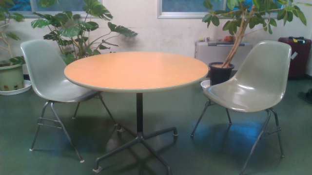
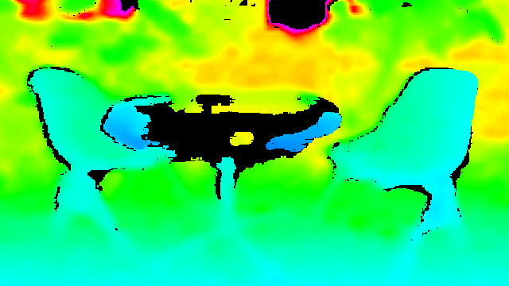

# simple_realsense
## preparement
```
pip install -r requirements.txt
```

## capture_and_record.py
```
usage: capture_and_record.py [-h] -s SAVE_PER_SEC

capture and record image and depth_map

optional arguments:
  -h, --help            show this help message and exit
                        saving rate specified like frame/save_per_sec
```
realsenseから得たデータをキャプチャしつつ、指定したインターバルで記録する。例えば、`python capture_and_record.py -s 5`、あるいは`python capture_and_record.py --save_per_sec 5`のように指定すると、1秒間に5回記録する。

記録は**log**フォルダの中に作成された**西暦-月-日_時-分**フォルダに**西暦-月-日_時-分-ミリ秒-{img / depth}.png**として記録される。次図はその一例。




depthを可視化する際には[JETなどの疑似カラー（カラーマップ）](https://docs.opencv.org/4.x/d3/d50/group__imgproc__colormap.html)が用いられるが、128階調だと分解能が足りない。ここでは次のようにmatplotlibに用意されているカラーマップ"gist_rainbow"を10000階調で作成し、uint8化して得た重複のない1377階調を得ることにした。カラーマップの階調を増やす方法（あるいは階調の大きいカラーマップ）について引き続き調査中。

https://github.com/ail-and-colleagues/simple_realsense/blob/d66de80901f03c97c18221fd9dd8c8ff71174002/utils.py#L88-L100

画像が保存されるフォルダには併せて実行時の設定やrealsenseの内部パラメータ(intrinsics)を記録した**conf.yaml**も保存される。

## rgbd_to_ply.py
```
usage: rgbd_to_ply.py [-h] -i IMAGE

convert image and depth_map to ply

optional arguments:
  -h, --help            show this help message and exit
  -i IMAGE, --image IMAGE
                        a color image path
```
capture_and_record.pyにて作成した画像と深度（のカラーマップ）から三次元点群を生成する。`python rgbd_to_ply.py -i 西暦-月-日_時-分-ミリ秒-img.png`ないし`python rgbd_to_ply.py --image 西暦-月-日_時-分-ミリ秒-img.png`のように画像データを指定すると、それに対応する**～～-depth.png**と**conf.yaml**から次図のような三次元点群を作成し、同フォルダに**西暦-月-日_時-分-ミリ秒-{img / depth}.ply**として保存する。


## bag_to_png_ply.py
```
usage: bag_to_png_ply.py [-h] -b BAG_FILE -i INTERVAL -o OUT_DIR

extract png and ply image from bag

optional arguments:
  -h, --help            show this help message and exit
  -b BAG_FILE, --bag_file BAG_FILE
                        bag_file or dir
  -i INTERVAL, --interval INTERVAL
                        saving interval
  -o OUT_DIR, --out_dir OUT_DIR
                        output directory
```
realsense viewerで録画した.bagファイルを指定したインターバルで.pngと.plyに書き出す。ただし、pyrealsense2で.bagを読み出す場合、デバイスを接続するのと同様に`wait_for_frames()`からは最新のフレームが返却される（i.e. cv2のread()のように次のフレームを返すわけではない）ため、実際のインターバルはPCの処理能力に寄り、現実的には *-i 20* 程度になると思われる。
書き出しディレクトリは`-o`で指定する(`-o D://temp`で他のドライブの指定可能)。ファイル名は {*bag_file_name*}_{*frame_index*}.png/.plyとなっている。


